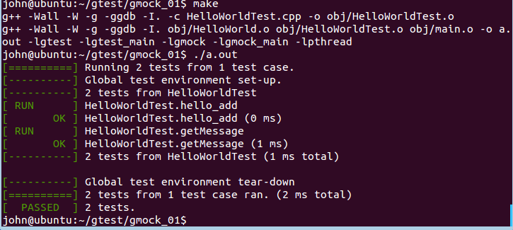

ubuntu gtest/gmock环境配置参考

http://blog.csdn.net/qq_26437925/article/details/68947498

---

源代码见code/*

* HelloWorld 使用了Messgener(一个抽象类，还未实现方法)

* 使用 MockMessgener 来模拟 Messgerner

* 使用 HelloWorldTest 来测试 HelloWorld，利用Mock

make后的运行截图
