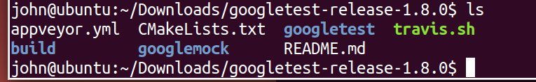
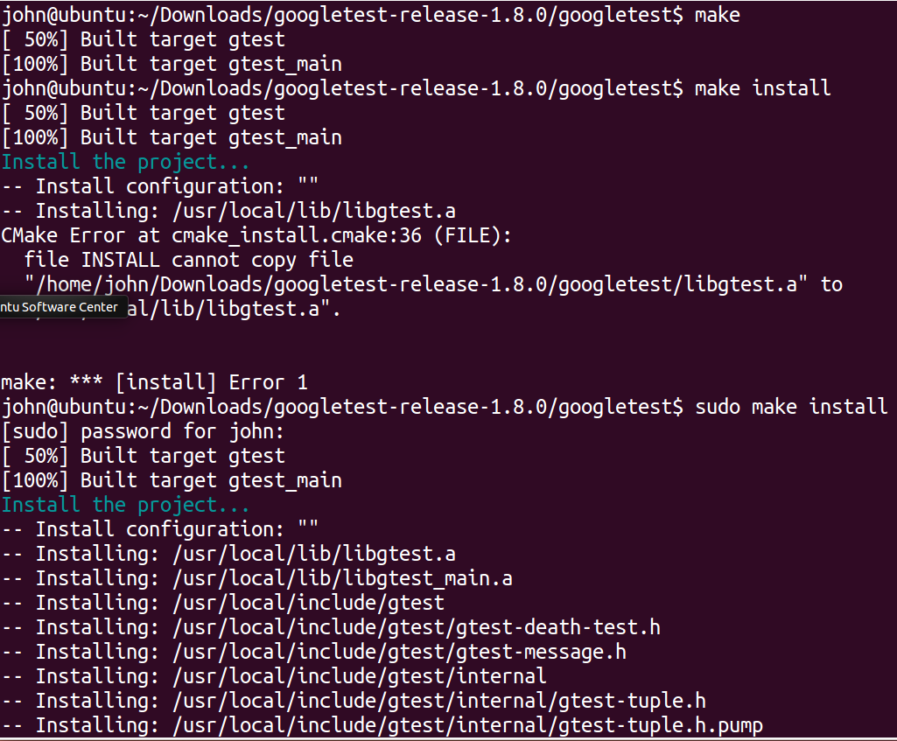
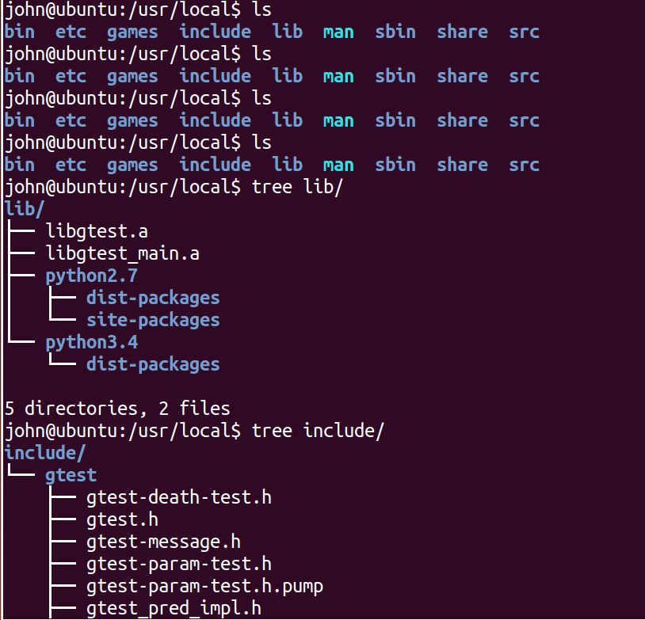
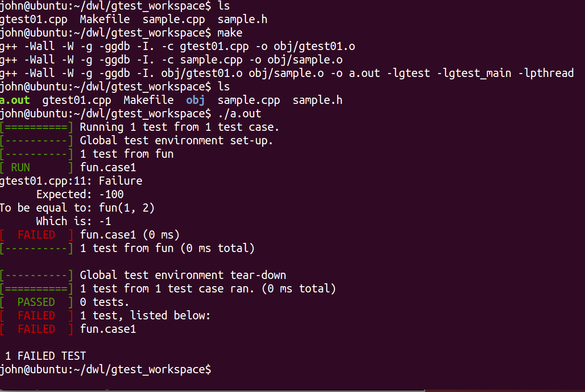

# linux下gtest的使用

## 环境配置（ubuntu 14.04 32bit）

直接去官方网站下载，可以下载最新的release版本
https://github.com/google/googletest



如下的一些命令，关键词需要有所了解
```
.sh
cmake
g++

sudo make
sudo make install
```

下面的几个安装的截图，头文件和相应的.a文件会安装到/usr/local下面






## 编写和测试gtest

需要注意编译用g++,使用-lgest等链接静态库文件

代码见code文件夹,运行截图如下



##
