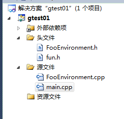
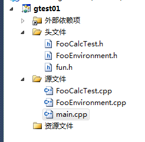
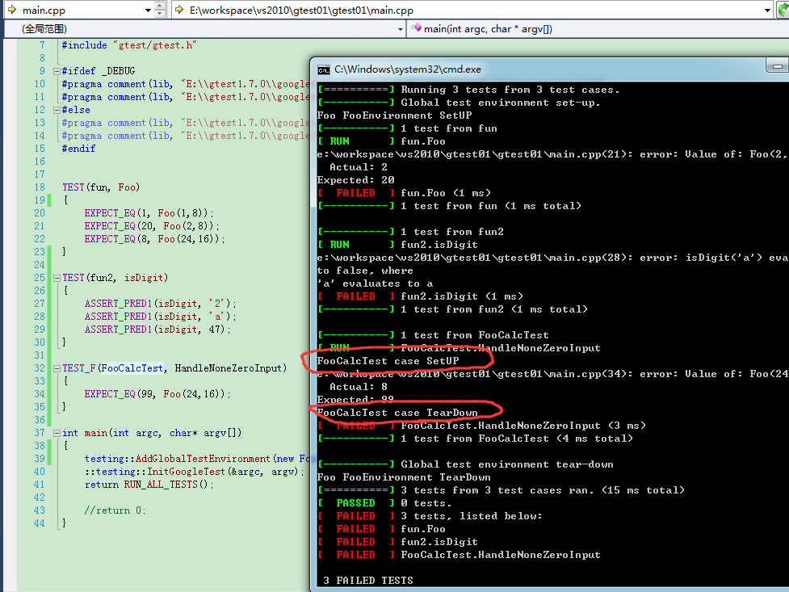

gtest提供事件机制，主要是测试时候，可以在测试案例前后做一些操作

# 全局事件
要实现全局事件，必须写一个类，继承testing::Environment类，实现里面的SetUp和TearDown方法。

1. SetUp()方法在所有案例执行前执行

2. TearDown()方法在所有案例执行后执行


项目结构1



main.cpp
```
#include <cstdio>
#include <cstring>
#include <string>
#include "fun.h"
#include "FooEnvironment.h"

#include "gtest/gtest.h"

#ifdef _DEBUG  
#pragma comment(lib, "E:\\gtest1.7.0\\googletest-release-1.7.0\\msvc\\gtest\\Debug\\gtestd.lib")  
#pragma comment(lib, "E:\\gtest1.7.0\\googletest-release-1.7.0\\msvc\\gtest\\Debug\\gtest_maind.lib")  
#else  
#pragma comment(lib, "E:\\gtest1.7.0\\googletest-release-1.7.0\\msvc\\gtest\\Release\\gtest.lib")  
#pragma comment(lib, "E:\\gtest1.7.0\\googletest-release-1.7.0\\msvc\\gtest\\Release\\gtest_main.lib")   
#endif


TEST(fun, Foo)  
{  
	EXPECT_EQ(1, Foo(1,8)); 
	EXPECT_EQ(20, Foo(2,8)); 
	EXPECT_EQ(8, Foo(24,16)); 
}

TEST(fun2, isDigit)  
{  
	ASSERT_PRED1(isDigit, '2');
	ASSERT_PRED1(isDigit, 'a');
	ASSERT_PRED1(isDigit, 47);
}

int main(int argc, char* argv[])
{
	testing::AddGlobalTestEnvironment(new FooEnvironment);
	::testing::InitGoogleTest(&argc, argv);  
	return RUN_ALL_TESTS();  

	//return 0;
}
```


FooEnvironment.h
```
#pragma once

#include "gtest/gtest.h"

// 全局事件
class FooEnvironment : public testing::Environment
{
public:

	// 1. SetUp()方法在所有案例执行前执行
	virtual void SetUp();

	// 2. TearDown()方法在所有案例执行后执行
	virtual void TearDown();

};

```

运行截图


---

# TestSuite事件

我们需要写一个类，继承testing::Test，然后实现两个静态方法

1. SetUpTestCase() 方法在第一个TestCase之前执行

2. TearDownTestCase() 方法在最后一个TestCase之后执行


# TestCase事件
TestCase事件是挂在每个案例执行前后的，实现方式和上面的几乎一样，不过需要实现的是SetUp方法和TearDown方法：

1. SetUp()方法在每个TestCase之前执行
2. TearDown()方法在每个TestCase之后执行


项目结构


添加了FooClalTest.h和FooClalTest.cpp文件

头文件
```
#pragma once

#include "gtest/gtest.h"

// TestCase事件
class FooCalcTest : public testing::Test
{
protected:
	virtual void SetUp();
	
	virtual void TearDown();
};

```


运行截图


---