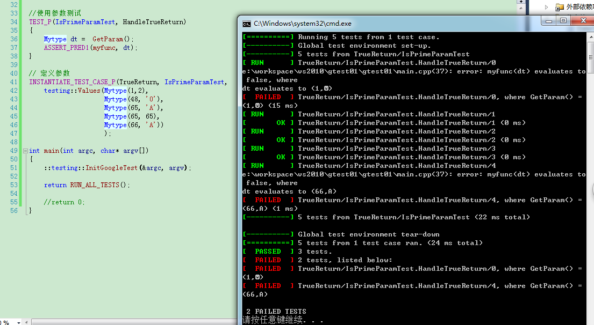

gtest 参数化

在测试时，经常需要考虑被测函数传入不同参数的值的情况。当然可以写很多的Assert或 EXPECT断言，但是是不是太多了，要写多少重复的的东西

比如
```
TEST(IsPrimeTest, HandleTrueReturn)
{
    EXPECT_TRUE(IsPrime(3));
    EXPECT_TRUE(IsPrime(5));
    EXPECT_TRUE(IsPrime(11));
    EXPECT_TRUE(IsPrime(23));
    EXPECT_TRUE(IsPrime(17));
}
```

参数化，采用一个较为通用的方法，你要测多少数据，自己加上就行了，不需要copy那么多一样的代码

## 实例
项目文件


IsPrimeParamTest.h
```
#pragma once

#include "gtest/gtest.h"

class IsPrimeParamTest : public testing::TestWithParam<int>
{

};

```

main.cpp
```
#include <cstdio>
#include <cstring>
#include <string>
#include "fun.h"

#include "IsPrimeParamTest.h"

#include "gtest/gtest.h"

#ifdef _DEBUG  
#pragma comment(lib, "E:\\gtest1.7.0\\googletest-release-1.7.0\\msvc\\gtest\\Debug\\gtestd.lib")  
#pragma comment(lib, "E:\\gtest1.7.0\\googletest-release-1.7.0\\msvc\\gtest\\Debug\\gtest_maind.lib")  
#else  
#pragma comment(lib, "E:\\gtest1.7.0\\googletest-release-1.7.0\\msvc\\gtest\\Release\\gtest.lib")  
#pragma comment(lib, "E:\\gtest1.7.0\\googletest-release-1.7.0\\msvc\\gtest\\Release\\gtest_main.lib")   
#endif


//TEST(fun, Foo)  
//{  
//	EXPECT_EQ(1, Foo(1,8)); 
//	EXPECT_EQ(20, Foo(2,8)); 
//	EXPECT_EQ(8, Foo(24,16)); 
//}

//TEST(fun2, isDigit)  
//{  
//	ASSERT_PRED1(isDigit, '2');
//	ASSERT_PRED1(isDigit, 'a');
//	ASSERT_PRED1(isDigit, 47);
//}

// 使用参数测试
TEST_P(IsPrimeParamTest, HandleTrueReturn)
{
	int n =  GetParam();
	//EXPECT_TRUE(IsPrime(n));
	ASSERT_PRED1(IsPrime, n);
}

// 定义参数
INSTANTIATE_TEST_CASE_P(TrueReturn, IsPrimeParamTest,
	testing::Values(100, 3, 5, 11, 23, 17, 200));


int main(int argc, char* argv[])
{
	::testing::InitGoogleTest(&argc, argv);  

	return RUN_ALL_TESTS();  

	//return 0;
}
```


运行截图


可以看到每个数值都进行了测试，并且有相关的结果

---

## 自定义结构的参数化（同上）

**自定义的结构体必须提供 重载<<运算**

DataTypes.h
```
#pragma once

#include <iostream>
typedef struct Mytype
{
	int a;
	char b;

	Mytype(int _a = 0, char _b = 0)
	{
		a = _a;
		b = _b;
	}

	friend std::ostream& operator<<(std::ostream& out,const Mytype& mt)
	{
		out << "(" << mt.a << "," << mt.b << ")";
		return out;
	}

}Mytype;
```

IsPrimeParamTest.h
```
#pragma once

#include "gtest/gtest.h"

#include "DataTypes.h"

class IsPrimeParamTest : public testing::TestWithParam<Mytype>
{

};

```

fun.h中有个 使用 Mytype的函数
```
#include "DataTypes.h"
bool myfunc(Mytype dt)
{
	return dt.a == dt.b;
}
```

最后main.cpp
```
#include <cstdio>
#include <cstring>
#include <string>

#include "fun.h"
#include "IsPrimeParamTest.h"

#include "gtest/gtest.h"

#ifdef _DEBUG  
#pragma comment(lib, "E:\\gtest1.7.0\\googletest-release-1.7.0\\msvc\\gtest\\Debug\\gtestd.lib")  
#pragma comment(lib, "E:\\gtest1.7.0\\googletest-release-1.7.0\\msvc\\gtest\\Debug\\gtest_maind.lib")  
#else  
#pragma comment(lib, "E:\\gtest1.7.0\\googletest-release-1.7.0\\msvc\\gtest\\Release\\gtest.lib")  
#pragma comment(lib, "E:\\gtest1.7.0\\googletest-release-1.7.0\\msvc\\gtest\\Release\\gtest_main.lib")   
#endif


//使用参数测试
TEST_P(IsPrimeParamTest, HandleTrueReturn)
{
	Mytype dt =  GetParam();
	ASSERT_PRED1(myfunc, dt);
}

// 定义参数
INSTANTIATE_TEST_CASE_P(TrueReturn, IsPrimeParamTest,
	testing::Values(Mytype(1,2),
					Mytype(48, '0'), 
					Mytype(65, 'A'), 
					Mytype(65, 65), 
					Mytype(66, 'A'))
					);

int main(int argc, char* argv[])
{
	::testing::InitGoogleTest(&argc, argv);  
	
	return RUN_ALL_TESTS();

	//return 0;
}
```

运行截图




---
