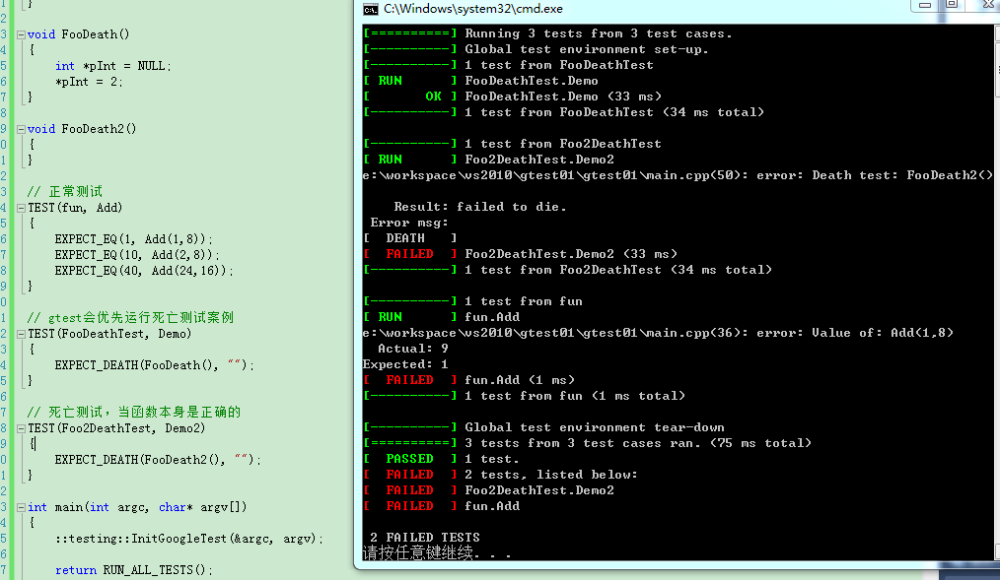
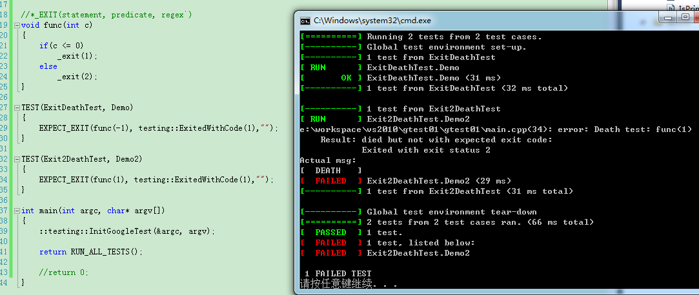

死亡测试

“死亡”指的是程序的崩溃。通常在测试过程中，需要考虑到各种各样的输入，有的输入可能导致程序崩溃；或者某段程序本身存在内存泄漏，指针错误访问等崩溃现象，这时我们需要检查程序是否按照预期的方式挂掉，这也就是所谓的“死亡测试”。gtest的死亡测试能做到在一个安全的环境下执行崩溃的测试案例，同时又对崩溃结果进行验证。

具体会使用如下的两个宏
1. ASSERT_DEATH(statement, regex`);
2. EXPECT_DEATH(statement, regex`);


## 实例分析
* 一个main.cpp
```
#include <cstdio>
#include <cstring>
#include <string>

#include "gtest/gtest.h"

#ifdef _DEBUG  
#pragma comment(lib, "E:\\gtest1.7.0\\googletest-release-1.7.0\\msvc\\gtest\\Debug\\gtestd.lib")  
#pragma comment(lib, "E:\\gtest1.7.0\\googletest-release-1.7.0\\msvc\\gtest\\Debug\\gtest_maind.lib")  
#else  
#pragma comment(lib, "E:\\gtest1.7.0\\googletest-release-1.7.0\\msvc\\gtest\\Release\\gtest.lib")  
#pragma comment(lib, "E:\\gtest1.7.0\\googletest-release-1.7.0\\msvc\\gtest\\Release\\gtest_main.lib")   
#endif

int Add(int a,int b)
{
	return a + b;
}

void FooDeath()
{
	int *pInt = NULL;
	*pInt = 2;
}

void FooDeath2()
{
}

// 正常测试
TEST(fun, Add)  
{  
	EXPECT_EQ(1, Add(1,8)); 
	EXPECT_EQ(10, Add(2,8)); 
	EXPECT_EQ(40, Add(24,16)); 
}

// gtest会优先运行死亡测试案例
TEST(FooDeathTest, Demo)
{
	EXPECT_DEATH(FooDeath(), "");
}

// 死亡测试，当函数本身是正确的
TEST(Foo2DeathTest, Demo2)
{
	EXPECT_DEATH(FooDeath2(), "");
}

int main(int argc, char* argv[])
{
	::testing::InitGoogleTest(&argc, argv);  
	
	return RUN_ALL_TESTS();

	//return 0;
}
```

* 运行截图


* 分析

测试会优先的运行死亡测试案例，上面的示例中，有三个测试案例（两个使用死亡测试，一个是正常测试，在死亡测试中，其中一个确实是“死亡”的，但另外一个是正常的），通过程序运行截图可以发现

* 死亡测试时优先于正常的测试案例的，跟程序放的上下文位置没有关系，死亡测试请使用***DeathTest**的测试名

* 死亡测试，如果真的是"死亡"的，那么会出现绿色的正常的RUN

* 死亡测试，如果不是真的“死亡”，会出现红色的“failed to die”


---


## *_EXIT(statement, predicate, regex`) 测试

* 1）statement是被测试的代码语句

* 2）predicate 在这里必须是一个委托，接收int型参数，并返回bool。只有当返回值为true时，死亡测试案例才算通过。gtest提供了一些常用的predicate：
```
testing::ExitedWithCode(exit_code)  
```
如果程序正常退出并且退出码与exit_code相同则返回 true

* 3) regex是一个正则表达式，用来匹配异常时在stderr中输出的内容这里， 要说明的是，*_DEATH其实是对*_EXIT进行的一次包装，*_DEATH的predicate判断进程是否以非0退出码退出或被一个信号杀死.


* main.cpp
```
#include <cstdio>
#include <cstring>
#include <string>

#include "gtest/gtest.h"

#ifdef _DEBUG  
#pragma comment(lib, "E:\\gtest1.7.0\\googletest-release-1.7.0\\msvc\\gtest\\Debug\\gtestd.lib")  
#pragma comment(lib, "E:\\gtest1.7.0\\googletest-release-1.7.0\\msvc\\gtest\\Debug\\gtest_maind.lib")  
#else  
#pragma comment(lib, "E:\\gtest1.7.0\\googletest-release-1.7.0\\msvc\\gtest\\Release\\gtest.lib")  
#pragma comment(lib, "E:\\gtest1.7.0\\googletest-release-1.7.0\\msvc\\gtest\\Release\\gtest_main.lib")   
#endif

//*_EXIT(statement, predicate, regex`) 
void func(int c)
{
	if(c <= 0)
		_exit(1);
	else 
		_exit(2);
}

TEST(ExitDeathTest, Demo)
{
	EXPECT_EXIT(func(-1), testing::ExitedWithCode(1),"");
}

TEST(Exit2DeathTest, Demo2)
{
	EXPECT_EXIT(func(1), testing::ExitedWithCode(1),"");
}

int main(int argc, char* argv[])
{
	::testing::InitGoogleTest(&argc, argv);  
	
	return RUN_ALL_TESTS();

	//return 0;
}
```

* 运行截图




---
注：更多请参考官方文档，本文可能有错，需实践。
