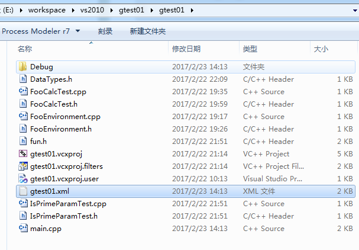
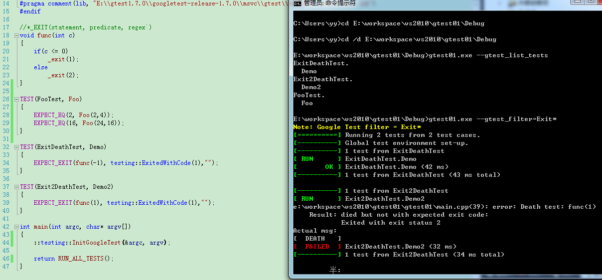

使用gtest编写的测试案例通常本身就是一个可执行文件，因此运行起来非常方便。同时，gtest也为我们提供了一系列的运行参数（环境变量、命令行参数或代码里指定），使得我们可以对案例的执行进行一些有效的控制。

gtest三种运行参数

1. 系统环境变量
2. 命令行参数
3. 代码中指定FLAG

---

#### 面能将特殊结果放入到一个xml文档中
```
int main(int argc, char* argv[])
{
	testing::GTEST_FLAG(output) = "xml:";

	::testing::InitGoogleTest(&argc, argv);  
	
	return RUN_ALL_TESTS();
}
```



---

### 命令行参数

#### --gtest\_list\_tests	
--gtest\_list\_tests 使用这个参数时，将不会执行里面的测试案例，而是输出一个案例的列表。


#### --gtest\_filter 对执行的测试案例进行过滤，支持通配符


运行所有测试案例名称为Exit开头的




---

通过命令行参数还能设置测试案例的输出
* 设置输出的一些颜色
* 打印出测试案例的执行时间（默认不打印）
* 将测试结果输出到另外的文件中（上文有实例）

通过命令行还能对案例异常进行处理
* 设置当案例失败时，如抛出异常，弹出对话框
* 调试模式下，案例失败时停止，方面调试

更多参考
http://www.cnblogs.com/coderzh/archive/2009/04/10/1432789.html

---

